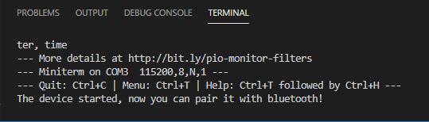

# PRACTICA 2 : WIFI y BLUETOOTH
## Practica B comunicación bluetooth con el movil
### CÓDIGO:
```cpp

#include "BluetoothSerial.h"
#if !defined(CONFIG_BT_ENABLED) || !defined(CONFIG_BLUEDROID_ENABLED)
#error Bluetooth is not enabled! Please run `make menuconfig` to and enable it
#endif
BluetoothSerial SerialBT;
void setup() {
Serial.begin(115200);
SerialBT.begin("ESP32testOriolPol"); //Bluetooth device name
Serial.println("The device started, now you can pair it with bluetooth!");
}
void loop() {
if (Serial.available()) {
SerialBT.write(Serial.read());
}
if (SerialBT.available()) {
Serial.write(SerialBT.read());
}
delay(20);
}

```

### FUNCIONAMIENTO:

Para esta parte de la práctica, vamos a realizar una comunicación mediante bluetooth.
El dispositivo bluetooth (slave) va a recibir mensajes des de un teléfono.
Con el código implementado permite conectar, mediante bluetooth, nuestra ESP32 con nuestro teléfono.

Una vez ejecutado el código, se muestra el siguiente mensaje por el monitor:



Para poder escribir des del teléfono y que se envie por bluetooth se necesita la app 'Serial Bluetooth Terminal'.

Una vez en la aplicación y ejecutado el programa, buscamos nuestra ESP32, en nustro caso le cambiamos el nombre a 'ESP32testOriolPol', cuando ya se haya realizado la conexió, se puede escribir des del teléfono y se mustra en el monitor y al revés.

Nuestra conversación fue tal que así:

